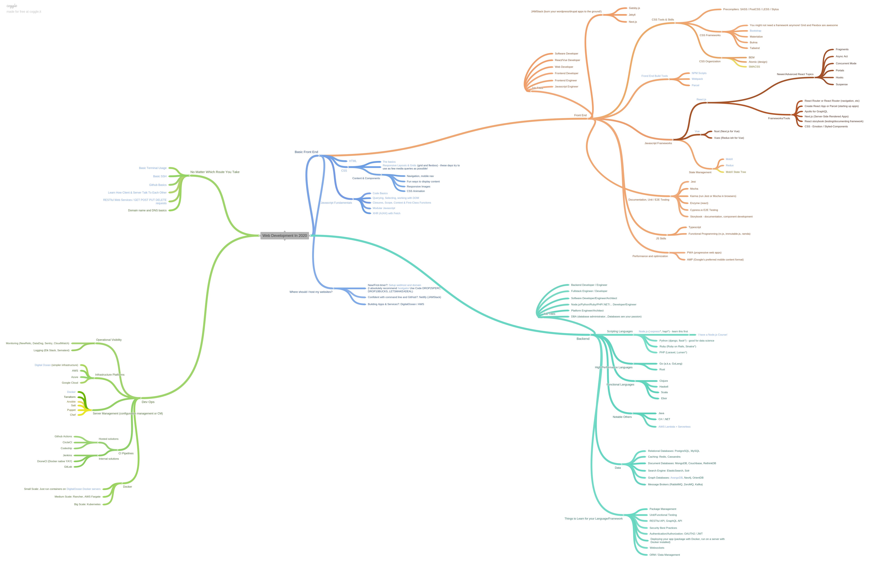
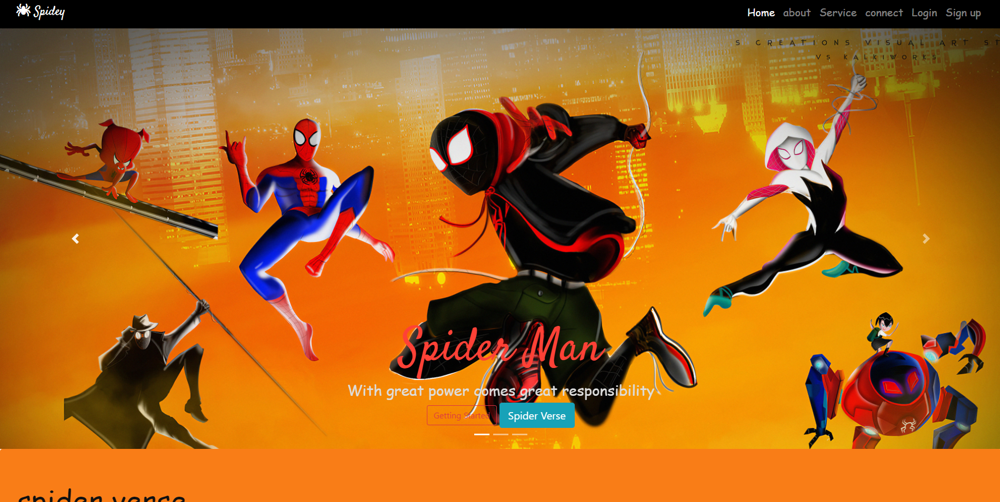
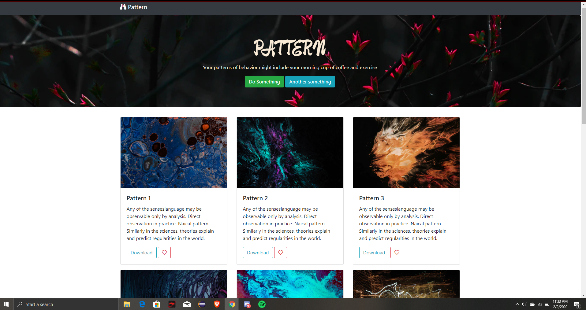
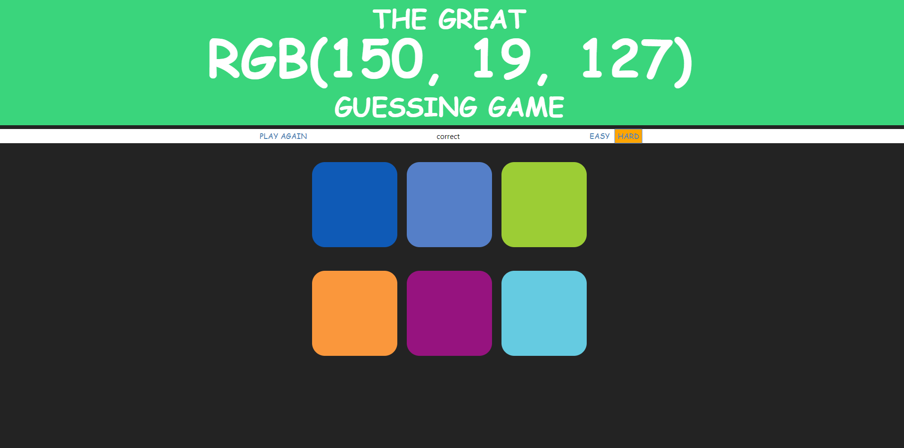

# web-development

# complete road map

# project 4

# project 

# event Reference 

https://developer.mozilla.org/en-US/docs/Web/Events

# rgb color picker

# site for getting linear gradients

https://uigradients.com/#Parklife

# icons
https://cdnjs.com/libraries/font-awesome

# paper.js
http://paperjs.org/

# backend

https://www.postman.com/  \
https://www.postman.com/how-api-collaboration-works

# windows-setup
https://zarkom.net/blogs/windows-local-coding-environment-1204   \
https://github.com/nodejs/node-gyp#on-windows
